<style>
@import url('https://fonts.googleapis.com/css2?family=Prompt:ital,wght@0,100;0,300;0,400;0,700;1,100;1,300;1,400;1,700&display=swap');

    :root {
    font-family: Prompt;
    --hl-color: #D57E7E;
}
h1 {
  font-family: Prompt
}
</style>

# Production Supporting Systems in Factories

## ระบบสนับสนุนการผลิตในโรงงานอุตสาหกรรม

---

# Context (Basics)

---

# Scope

The `scope` of a particular context value.

- `Node` - only visible to the node that set the value
- `Flow` - visible to all nodes on the same flow (or tab in the editor)
- `Global` - visible to all nodes

---

## Use `flow` Context to Pass Values

---

# Set `flow` Context

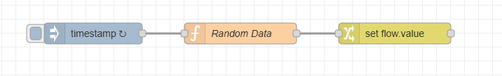

---

# `inject` Node

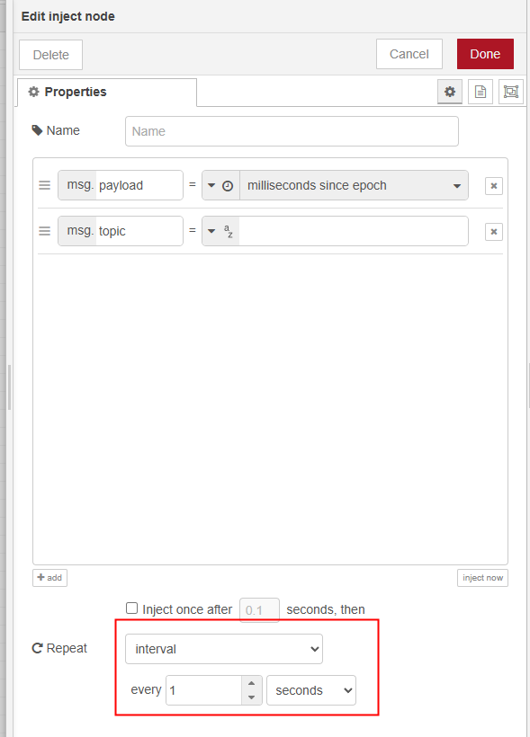

---

# `random data` Function Node

```js
msg.payload = Math.random();
return msg;
```

---

# `change` Node

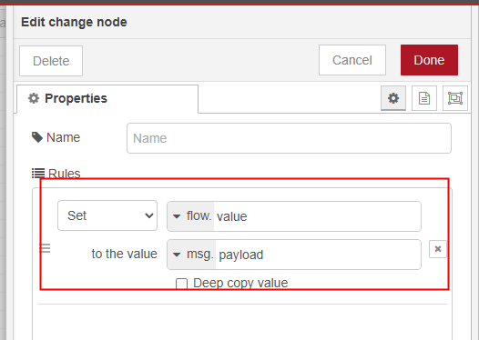

---

# Get Context Data

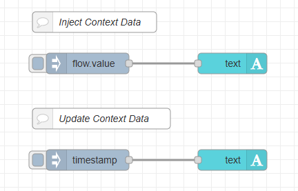

---

# `Inject Context Data` Flow

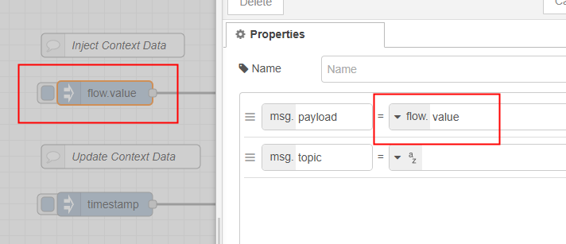

---

# `Inject Context Data` Flow

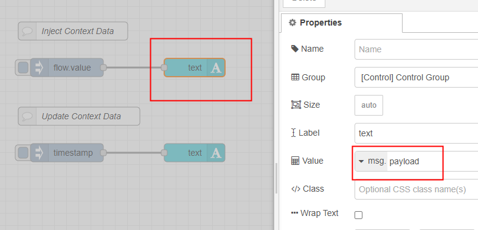

---

# `Update Context Data` Flow

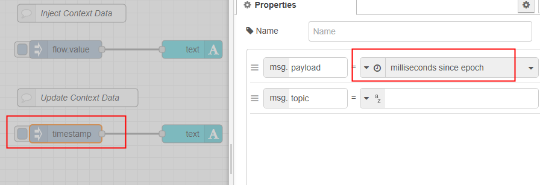

---

# `Update Context Data` Flow

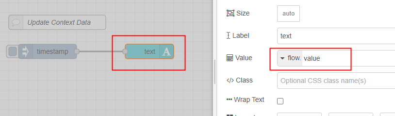

---

# Using `function` Node to Set Context Value

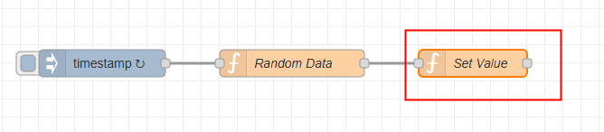

```js
flow.set("value", msg.payload);
```

---

# Using `function` Node to Get Context Value

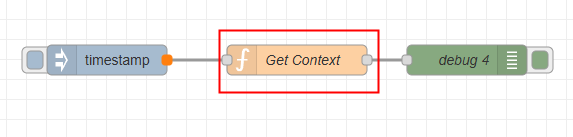

```js
const value = flow.get("value") ?? 0;
msg.payload = value;
return msg;
```

---

# Initialize Context Value

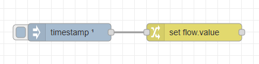

---

# `inject` Node

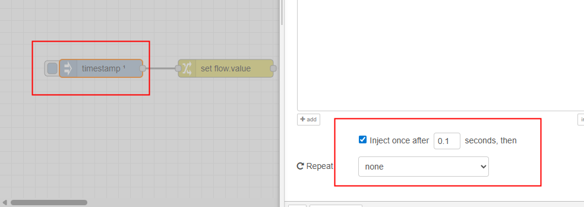

---

# `change` Node

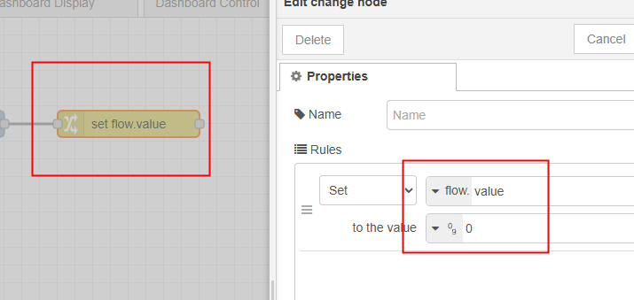

---

# Counter with reset button

---

# Flow

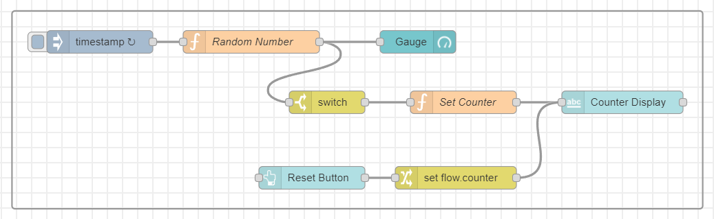

---

# `Random Number` (function) node

```js
msg.payload = Math.random();
return msg;
```

---

# `Switch` node

## 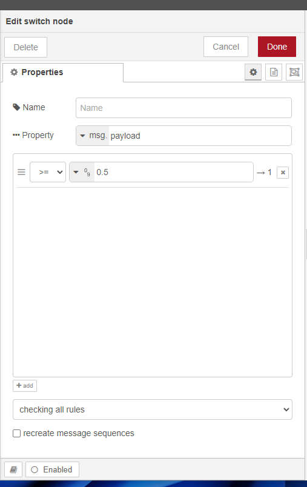

---

# `Set Counter` (Function) node

```js
const curCounter = flow.get("counter") ?? 0;
flow.set("counter", curCounter + 1);
msg.payload = curCounter + 1;
return msg;
```

---

# `button` node

## 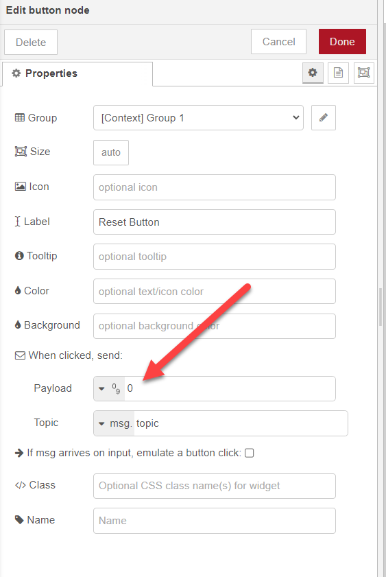

---

# `change` node

## 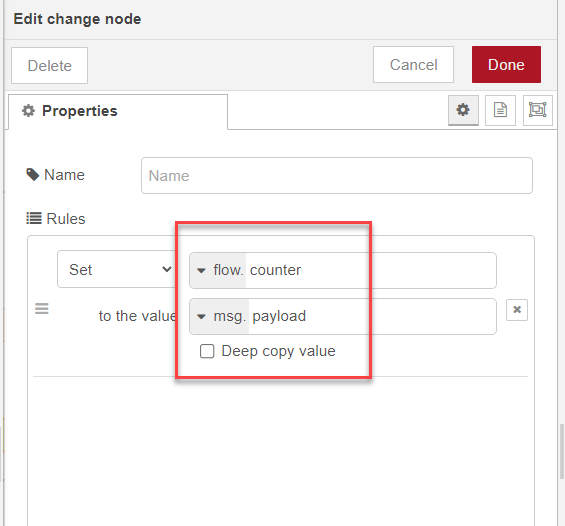

---

# Turning sensor display on and off

---

# Flow

## 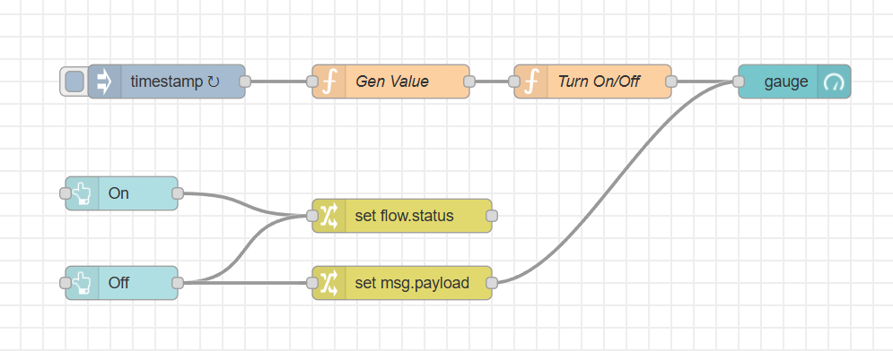

---

# `function` node (Gen Value)

```js
msg.payload = Math.random();
return msg;
```

---

# `function` node (Turn On/Off)

```js
const status = flow.get("status") ?? "OFF";
if (status === "ON") {
  return msg;
} else {
  // Do nothing
}
```

---

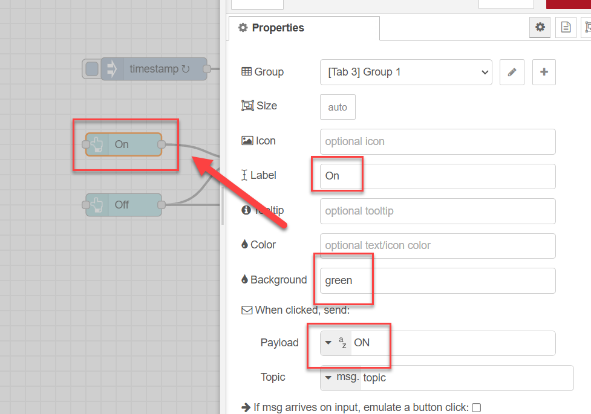

---

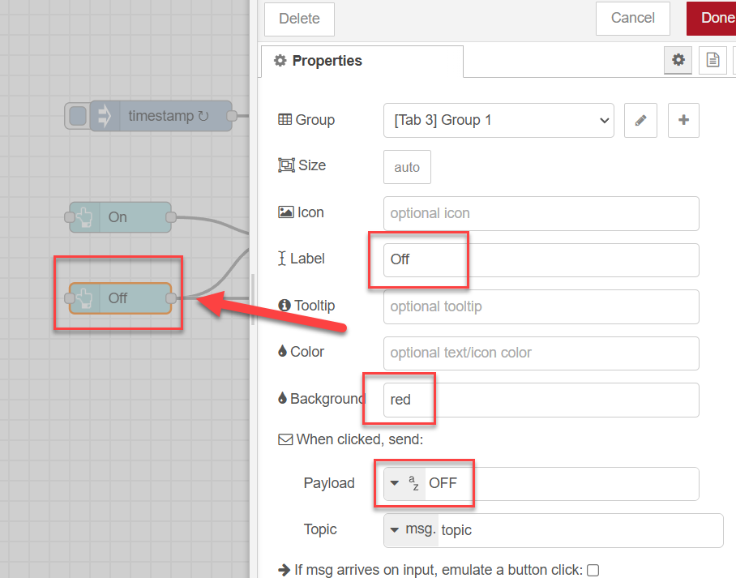

---

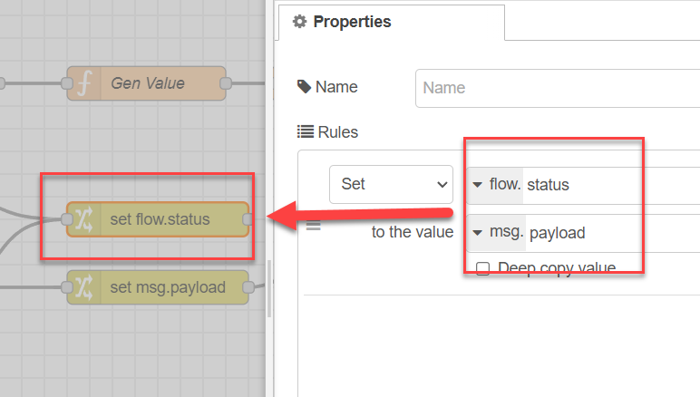

---

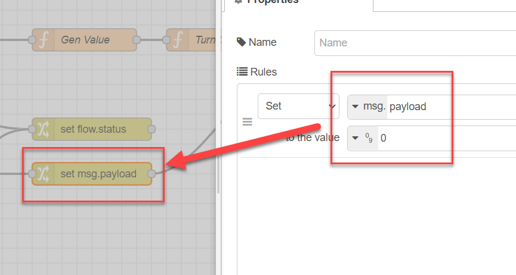
