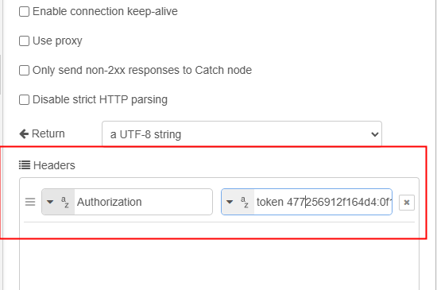

<style>
@import url('https://fonts.googleapis.com/css2?family=Prompt:ital,wght@0,100;0,300;0,400;0,700;1,100;1,300;1,400;1,700&display=swap');

    :root {
    font-family: Prompt;
    --hl-color: #D57E7E;
}
h1 {
  font-family: Prompt
}
</style>

# Production Supporting Systems in Factories

## ระบบสนับสนุนการผลิตในโรงงานอุตสาหกรรม

---

# Integration

> HTTP Request between ERPNext and Node-RED

---

# What is HTTP Request?

- HTTP (Hypertext Transfer Protocol) is the foundation of data communication on the World Wide Web.
- We can connect ERPNext and Node-RED via HTTP Request to exchange data.

---

# HTTP Methods

- `GET`: Retrieve data from a server.
- `POST`: Send data to a server to create a resource.

---

# Primer: HTTP Request to Google


- Method: `GET`
- URL: `https://www.google.com`

---

# Part 1: Node-RED to ERPNext

---

# Get API `Key` and `Secret`


---

# Construct Token

```bash
KEY=
SECRET=
TOKEN=${KEY}:${SECRET}
```

---

# Construct URL

```bash
BASE_URL=https://pmX-erpXX.iecmu.com

URL1=${BASE_URL}/api/resource/Sales Order
URL2=${BASE_URL}/api/resource/Sales Order?fields=["*"]
URL3=${BASE_URL}/api/resource/Sales Order?fields=["*"]&filters=[["docstatus","=","1"]]
```

---

# HTTP Request Flow


- Method: `GET`
- URL: `URL1`, `URL2`, or `URL3`
- Headers: `Authorization: token {TOKEN}`

---

# Headers



---

# Project Demo

- Get `Work Order` data from `ERPNext`

```bash
${BASE_URL}/api/resource/Work Order?fields=["*"]&filters=[["docstatus","=","1"],["status","in",["Not Started", "In Process"]]]
```
